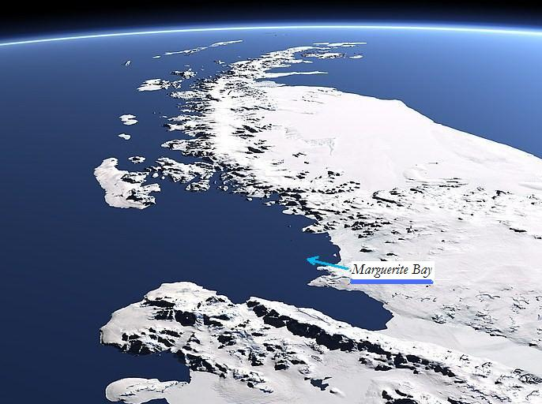

```{r setup, include=FALSE}
knitr::opts_chunk$set(echo = FALSE, results = FALSE, message=FALSE, warning=FALSE)
```

# The Degradation of Sea Ice in The Marguerite Bay

Michael Slaughter

    Biosciences Department, Minnesota State University Moorhead, 1104 7th Avenue South, Moorhead, MN 56563 USA

## Abstract

Antarctic Sea Ice is all the cumulative ice that floats on top of the Southern Ocean. The importance of the Arctic Sea ice varies to many reasons such as the maintenance of ocean water levels and allows species native to the arctic circle to get to their destinations with ease and gives them better access to hunting, which in return, prolongs their overall survival. In fact, one of the reasons the polar bear population is at a steady decrease is due to the decrease of ice levels in the arctic circle which has extremely limited their time span of hunting. My question is how much has Antarctic Sea Level concentrations decreased overtime ? To answer this, I will be using data provided by the National Snow and Ice Data Center. Two variables that I will be working with to understand the data is Ice Level Concentration and the corresponding month that the value was calculated. I think what I might find in this research is going to help raise awareness on how much Antarctic Sea Ice has been lost overtime and give an indication on how it may look for the future generations ahead.



## Introduction:

The Marguerite Bay is an area located in the Antarctic that contains a vast area of sea ice. I want to find out how much the concentration levels of sea ice in the area changes overtime and whether it is with a increase or decrease. As climate conditions are clearly worsening as the years go on, it is important to eyeball ice concentrations as the wildlife that lives around depends on it.


## Methods:

For this analysis I used R version 4.0.3 (R Core Team 2020) and RStudio version 1.3.1093 (Rstudio Team 2020)

### Data Acquisition

I found the data that worked best for me was provided the Palmer Station Antarctica.(Palmer Station Antarctica LTER and S. Stammerjohn 2020) published a study on monthly sea ice concentration in the Marguerite Bay area and that is the data set I chose. In order to access the data to full capacity, I had to make a free account with the site.

### Data Preparation

I first used the function read_fwf in the readr package (Hadley Wickham and Jim Hester 2020) to read in my sea ice data into a tibble. After that, I used the `fwf_widths` function to establish the widths of my columns and assign those columns to a variable name which were year and monthly sea ice concentrations. Finally, i skipped the first 8 lines of my data because they were statements about the data instead of numbers I couldn't use.

## Results:

```{r}
library(tidyverse)

#Loading in Sea Ice Data
seaiceData<-
read_fwf(
  file =  "Data/Antarctic Sea Ice Data Set.txt",
  col_positions = fwf_widths(
    widths = c(6, 10, 12,10,10,10,10,10,10,10,10,10,10),
    col_names = c("Year", "01", "02","03","04","05","06","07","08","09","10","11","12")
  ),
  na = "-999.00",
  skip = 8
)

extendiceData <-
pivot_longer(
  data = seaiceData,
  cols = `01`:`12`,
  names_to = "Month", 
  values_to = "Concentration",
  values_drop_na = TRUE
  )


mutate(
extendiceData,
  text_date = paste0(Year, "-", Month, "-01"),
  date = as.Date(text_date)
)

groupediceData <- group_by(extendiceData, Year)

SumgroupiceData <- summarize(groupediceData,avgannualConcent = mean(Concentration))

ggplot(data=SumgroupiceData,mapping=aes(x=Year,y=avgannualConcent))+
  geom_line()+
  geom_smooth(method=lm)+
  labs(x="Year", y="Average Concentration")+
  theme(
    axis.title = element_text(face = "bold"),
    axis.text = element_text(color = "black", size = rel(1)),
    axis.text.x = element_text(angle = 45, hjust = 1),
    axis.ticks.x = element_blank()
  )

```

Figure 1:

```{r}
monthgroupiceData <- group_by(extendiceData,Month)

summonthData <- summarize(monthgroupiceData,avgmonthConcent=mean(Concentration),.groups ="drop" )

ggplot(data=summonthData,mapping=aes(x=Month,y=avgmonthConcent))+
  geom_jitter(aes(y=Concentration),data=extendiceData,alpha=.3)+
  geom_col(color="darkblue",alpha=.5)+
  labs(x="Month", y="Average Concentration")+
  theme(
    axis.title = element_text(face = "bold"),
    axis.text = element_text(color = "black", size = rel(1)),
    axis.text.x = element_text(angle = 45, hjust = 1),
    axis.ticks.x = element_blank()
  )


```

Figure 2: 

## Discussion


## Literature Cited

Palmer Station Antarctica LTER and S. Stammerjohn. 2020. Average monthly sea ice coverage for the PAL LTER region West of the Antarctic Peninsula derived from passive microwave, 1978 - Apr. 2019 ver 6. Environmental Data Initiative. <https://doi.org/10.6073/pasta/d63bbcd641494e6f89143d011ea9cc2a> (Accessed 2021-03-25).

    Hadley Wickham and Jim Hester (2020). readr: Read Rectangular Text Data.

R package version 1.4.0. <https://CRAN.R-project.org/package=readr>

      RStudio Team (2020). RStudio: Integrated Development Environment for R.

RStudio, PBC, Boston, MA URL <http://www.rstudio.com/>.

    R Core Team (2020). R: A language and environment for statistical

computing. R Foundation for Statistical Computing, Vienna, Austria. URL <https://www.R-project.org/>.

Wickham et al., (2019). Welcome to the tidyverse. Journal of Open Source Software, 4(43), 1686, <https://doi.org/10.21105/joss.01686>

## References
